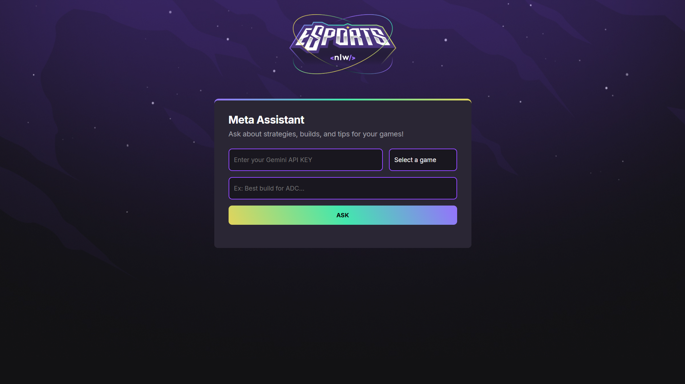

# Meta Assistant - Your eSports AI Assistant

## 🚀 Live Demo

**You can use the application directly in your browser! Just click the link below:**

### 👉 [https://filippochiarion.github.io/MetaAssistant-eSports/](https://filippochiarion.github.io/MetaAssistant-eSports/)

---

## 📖 About The Project

Meta Assistant is a web application designed to help eSports players improve their strategies and knowledge of their favorite games. Using the power of the Google Gemini API, the tool provides instant answers about builds, tactics, top champions/characters, and general tips for various games.

## ✨ Features

* **AI-Powered Tips:** Access a world of knowledge with the Gemini API.
* **Game Selection:** Choose a game for more accurate tips.
* **Intuitive Interface:** A clean and straightforward user experience.
* **Quick Answers:** Get the best builds and strategies in seconds.

## 🔧 How to Use

1. **Go to the [Live Demo link](https://filippochiarion.github.io/MetaAssistant-eSports/).**
2.  **Get your API Key:**
    * You will need a Google Gemini API Key. You can get one for free at [Google AI Studio](https://aistudio.google.com/).
    * Click on "Get API Key" and create a new key.
3.  **Set up the application:**
    * Paste your API key into the "Enter your Gemini API KEY" field.
    * Select the desired game from the dropdown.
    * Ask your question in the prompt field (e.g., "Best build for ADC...").
    * Click "ASK" and wait for the AI's response!

## 🛠️ Technologies Used

* **Frontend:** HTML5, CSS3, JavaScript
* **Artificial Intelligence:** Google Gemini API

## 🔮 Future Plans

* [ ] Integrate with more eSports games.
* [ ] Add a "Game not listed?" option for users to input a custom game name.
* [ ] Implement a login system (e.g., using Firebase) to securely save the user's API Key.
* [ ] Improve prompt engineering for more accurate and detailed AI responses.
